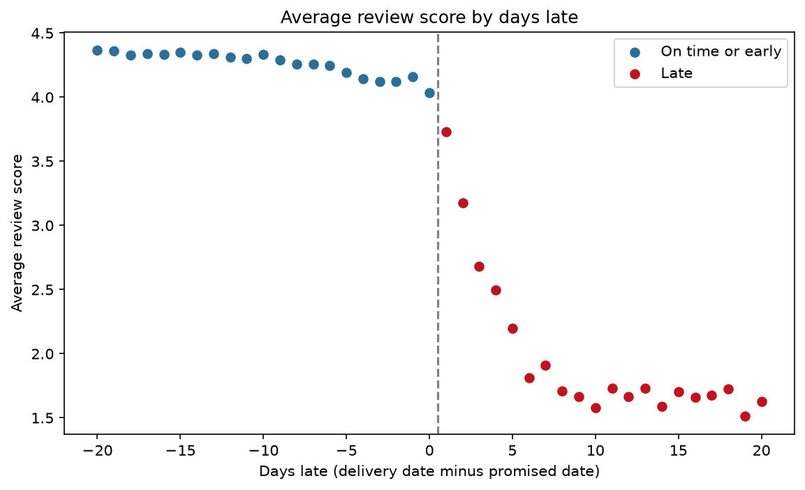

# The Late-Delivery Tax

In this project I looked at what happens when an online order arrives later than the date the customer was promised. I used the Olist dataset, a **public dataset from Kaggle** with about 99,000 orders from a Brazilian online marketplace (2016–2018). This is my own practice project. It is not work for any company.

**Main finding:** when an order is late, the chance that the customer gives a 1 or 2 star review goes up by about **52 percentage points**. This compares orders from the same seller. Late orders cause around **3,390 extra bad reviews**, which is about **28% of all bad reviews** in the data.

Dashboard: DASHBOARD_LINK
Short summary for managers: [docs/memo.md](docs/memo.md)



The chart shows the average review score against how many days late the order was. Orders on the left of the dashed line came on time or early. Orders on the right came late. The score starts dropping after the promised date and keeps falling for about a week.

## What I wanted to find out

1. How many orders are late, and how much money is in those orders?
2. Does being late actually **cause** bad reviews, or do late orders just happen to be the kind of orders that get bad reviews anyway?
3. What should the company fix first?

## What I found

**1. Late orders get much worse reviews, even for the same seller.**
I compared each seller's late orders with that same seller's on-time orders. I also kept the product category, the month and the customer's state the same, and I controlled for price, shipping cost, distance, weight and number of items. A late order got **1.95 fewer stars** on average, and was **52 percentage points more likely** to get a 1–2 star review.

**2. The longer the delay, the worse the review.**
Compared with orders that came 1–7 days early:

| When the order arrived | Change in review score |
|---|---|
| On the promised day | −0.16 stars |
| 1–3 days late | −0.83 stars |
| 4–7 days late | −2.00 stars |
| 8–14 days late | −2.40 stars |
| 15+ days late | −2.35 stars |

**3. There is no sudden drop exactly on the promised day.**
I also checked whether reviews drop suddenly between "arrived on the promised day" and "arrived 1 day late". This method is called a regression discontinuity. The result was **not significant** (−0.08 stars, p = 0.74). The checks for this method also failed:
- more orders arrive just on the promised day than you would expect
- orders just after the line were heavier and had longer promised times

So I don't rely on this test for the main claim. What it does show is that customers get upset gradually as the delay grows, not the moment the date passes. When I only used reviews written *after* the parcel actually arrived, there was a clear drop (−0.28 stars, p < 0.001).

**4. I could not tell whether late orders stop people coming back.**
Customers whose first order was late came back a bit less often (1.6% vs 2.0%). The difference was **not significant** (p = 0.15). Before running it, I had calculated that this test could only pick up a drop of about 0.67 percentage points, because very few customers ever come back. So this result means "not enough data to tell", not "no effect".

**5. A few sellers cause most of the late orders.**
The worst 5% of sellers (148 sellers) are behind **59% of all late orders**. They also handle about half of all orders, so part of this is just their size. Still, their late rate is 8.0%, against 5.6% for everyone else. Some states have much higher late rates: Alagoas 21%, Maranhão 17% and Sergipe 15%, against 6.8% overall.

**Size of the problem:** 6.8% of delivered orders were late, worth about **R$0.99 million** in sales. If the company promised 3 more days for every order and delivery times stayed the same, the share of late orders would fall from 6.8% to 4.8%, which means about 970 fewer bad reviews. But a longer promise might make some people not buy at all, and this data can't show that.

## How I did it

- **SQL (PostgreSQL):** I loaded the 9 CSV files into tables, cleaned them, and built one main table with one row per order (`fct_orders`). I then wrote 10 SQL queries for basic business numbers like monthly sales, repeat customers and late rate by state.
- **Plan written first:** before running any of the cause-and-effect tests, I wrote down exactly which tests I would run in [`analysis_plan.md`](analysis_plan.md) and committed it to git. That way I couldn't change the tests after seeing the results. Any change I had to make is written in [`docs/decisions_log.md`](docs/decisions_log.md).
- **Python:** I ran the tests in Jupyter notebooks:
  - `pyfixest` for the seller comparison (a fixed-effects regression)
  - `rdrobust` for the "sudden drop at the promised date" test
  - a simple regression for repeat purchases
- **Money and "what if" numbers:** notebook 04 works out the size of the problem and what happens if the promised date is moved by −5 to +5 days.
- **Tableau Public:** a 2-page dashboard made from the CSV files in `outputs/tableau/`.

## How to run it yourself

1. Install PostgreSQL 16 and Python 3.11:
   ```bash
   brew install postgresql@16
   brew services start postgresql@16
   export PATH="/opt/homebrew/opt/postgresql@16/bin:$PATH"
   createdb olist
   ```
2. Make a Python environment and install the packages:
   ```bash
   python3.11 -m venv .venv
   .venv/bin/pip install -r requirements.txt
   ```
3. Download the data from [Kaggle](https://www.kaggle.com/datasets/olistbr/brazilian-ecommerce) and unzip it into `data/raw/`. The data is not in this repo. You can also use the Kaggle command line:
   ```bash
   .venv/bin/kaggle datasets download -d olistbr/brazilian-ecommerce -p data/raw --unzip
   ```
4. Run everything. It builds the database, runs all the SQL and runs all 4 notebooks. It takes about 10 minutes:
   ```bash
   bash sql/00_setup/run_all.sh
   ```
5. The results are saved in `outputs/tables/`, `outputs/figures/` and `outputs/tableau/`.

## What is in each folder

| Folder | What's inside |
|---|---|
| `sql/00_setup` | Creates and loads the tables, data checks, and `run_all.sh` |
| `sql/01_staging` | Cleaned versions of each table |
| `sql/02_marts` | The main one-row-per-order table |
| `sql/03_kpis` | The 10 business questions |
| `sql/04_causal_prep` | Data for the tests, and the seller scorecard |
| `notebooks` | 01 promised-date test · 02 seller comparison · 03 repeat customers · 04 money and "what if" |
| `outputs` | Result tables, charts and the files for Tableau |
| `docs` | Data checks, decisions log, list of metrics, Tableau steps, memo |

## Data licence

The Olist data is under the **CC BY-NC-SA 4.0** licence. The raw data is not included in this repo.
